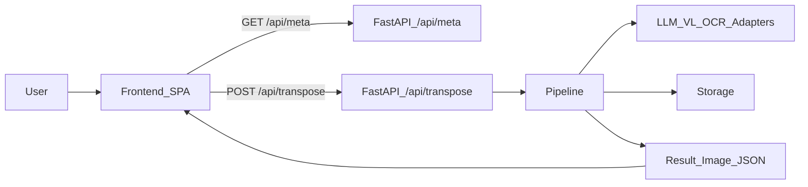

## TuneAI 是什么？

**TuneAI** 是一个「印刷简谱智能移调」工具：上传 PNG/JPG 简谱图，选择目标调，后端通过视觉大模型（Vision LLM）+ OCR + 规则/LLM 校验等多步流水线，将谱面自动转成目标调，并**保留原布局**输出新的简谱图，同时返回结构化 JSON 结果，便于后续分析或二次开发。

- **前端**：React + TypeScript + Tailwind CSS + Vite，提供单页应用（上传、目标调选择、结果查看与下载）。
- **后端**：FastAPI + Python，封装完整的识别与移调流水线，并托管前端构建产物（单端口部署方案）。

如果你是第一次接触本项目，**建议从本文件读到“快速开始”并跑通一次本地转调流程**，再根据需要阅读 `docs/` 中的架构与设计文档。

---

## 整体架构概览

从浏览器到后端流水线的数据流大致如下：



- 前端是一个单页应用（SPA），启动后会定期调用 `GET /api/meta` 获取系统状态、上传限制以及可用的 provider 列表与默认值。
- 用户上传简谱图片、选择目标调（以及可选的 provider），前端通过 `POST /api/transpose` 向后端提交请求。
- 后端内部通过一条**异步流水线**完成：图像预处理 → 视觉大模型识别调号 → OCR 提取数字 → 过滤得到音符事件 → 转调 → 多重校验 → 渲染新图片 → 返回结果。
- 最终响应中包含：移调后图片（base64）、结构化乐谱 JSON、warnings、处理耗时以及 `request_id`（便于日志排查）。

更详细的架构与模块拆分可参考 `docs/项目架构与模块说明.md` 与 `docs/TuneAI_完整执行方案.md`。

---

## 目录结构（精简说明）

项目根目录下主要子目录和文件含义如下（仅列出常用部分）：

- `frontend/`：前端代码（React + TypeScript + Tailwind CSS，Vite 构建）  
  - `src/main.tsx`：React 入口。  
  - `src/App.tsx`：根组件与整体布局。  
  - `src/hooks/useTranspose.ts`：上传、轮询 `/api/meta`、调用 `/api/transpose` 的核心逻辑与状态管理。  
  - `src/types/api.ts`：与后端接口对齐的 TypeScript 类型。  
  - `src/components/`：上传区、输入/输出面板、下载面板等 UI 组件。  
  - 更多前端细节见 `frontend/README.md`。

- `backend/tuneai/`：后端与核心流水线代码（FastAPI + Python）  
  - `main.py`：FastAPI 应用入口，挂载 API 路由，并在生产模式下托管前端静态资源（`frontend/dist`）。  
  - `api/routes.py`：定义 `GET /api/meta` 与 `POST /api/transpose`，负责请求校验、超时、统一 JSON 响应与错误包装。  
  - `api/dependencies.py`：请求依赖（如 `request_id`）。  
  - `core/application/pipeline.py`：端到端流水线总控，对外暴露 `run_pipeline` 与 `PipelineResult`。  
  - `schemas/`：API 请求/响应与内部 Score IR（乐谱中间表示）的 Pydantic 模型。  
  - `logging_config.py`：结构化日志、`request_id` 管理与 FastAPI 日志集成。  
  - `config.py`：配置中心，从根目录 `config.json` 读取配置，并支持环境变量覆盖。

- `data/`：示例数据与输出  
  - `data/samples/`：测试样本图片。  
  - `data/outputs/`：后端运行时的临时输出（可配置是否自动清理）。

- `assets/fonts/`：后端渲染时使用的字体资源。

- `docs/`：项目文档（中文）  
  - `项目架构与模块说明.md`：前后端分离架构与模块对照表。  
  - `TuneAI_完整执行方案.md`：完整设计与执行方案。  
  - `项目介绍.md`：项目背景与说明。  
  - 若干可行性评估与 provider 对比报告（LLM/VL/OCR、music21、简谱生成等）。

- `tests/`：测试用例。
- `backend/run.py`：后端启动实现（由 `Makefile` 调用，不推荐直接作为日常入口）。  
- `pyproject.toml`：Python 依赖与工具配置（Poetry）。  

---

## 快速开始（本地开发）

下面以**方案 A：单端口提供页面与 API** 为默认推荐方式。

### 1. 安装 Python 依赖（Poetry）

```bash
poetry install
```

### 2. 安装前端依赖（npm）

```bash
cd frontend
npm install
cd ..
```

### 3. 配置 `config.json`

项目根目录包含一个示例配置文件 `config.example.json`，首次使用时请：

```bash
cp config.example.json config.json
```

然后根据实际环境修改关键字段（详见下文“配置概览”）：

- `server.host` / `server.port`：后端监听地址与端口（默认 0.0.0.0:8000）。  
- `frontend.build_dir` / `frontend.dev_port`：前端构建输出目录与开发服务器端口（默认 `frontend/dist` 与 5173）。  
- `provider_policy.default_provider`：默认 provider 名称（例如 `glm`、`qwen` 等，需在 `providers` 节点中注册）。  
- `providers` 下的各模型与 OCR 配置（`api_key`、`base_url`、`model` 等）。  
- `pipeline`：单请求超时、最大图片大小、输入/输出目录、是否在响应后清理文件。  
- `logging`：日志级别、格式、日志文件路径与滚动策略。

建议将**密钥类信息放在环境变量中**，而不是直接写入 `config.json`；该文件已加入 `.gitignore`，不会提交到版本库。

### 4. 一键启动（后端 + 前端构建，单端口）

推荐通过 `Makefile` 作为统一入口：

```bash
# 开发模式（启用代码热重载）
make dev

# 生产模式（关闭 reload，以生产配置启动）
make prod
```

- 以上命令会在需要时自动执行前端构建（等价于先跑 `make build`），将构建产物输出到 `frontend/dist`（可通过 `config.json` 中的 `frontend.build_dir` 调整）。  
- 启动成功后，访问 `http://localhost:<server.port>`（默认为 `http://localhost:8000`）即可打开前端页面，并在同一端口下通过 API 完成移调。

### 5. 前端独立开发（热更新，API 通过代理）

在只关注前端 UI 与交互时，可以单独启动 Vite 开发服务器：

```bash
make web
```

- Vite 服务器端口由 `config.json` 中的 `frontend.dev_port` 决定（默认 5173）。  
- `frontend/vite.config.ts` 中已配置 `/api` 代理到后端 `server.port`，无需额外手动配置 CORS。

### 6. 生成 `requirements.txt`（仅部分部署场景需要）

如果目标环境不使用 Poetry，而是直接基于 `requirements.txt` 安装依赖，可以执行：

```bash
poetry export -f requirements.txt -o requirements.txt --without-hashes
```

---

## 配置概览

TuneAI 的配置由根目录的 `config.json` 提供，后端通过 `backend/tuneai/config.py` 统一读取，并支持环境变量覆盖。典型结构（仅示意关键部分）：

- **server**：服务监听设置  
  - `host`, `port`。

- **frontend**：前端构建相关  
  - `build_dir`：前端构建产物目录（默认 `frontend/dist`）。  
  - `dev_port`：Vite 开发服务器端口。  

- **provider_policy**：默认 provider 策略  
  - `default_provider`：统一默认 provider 名称（如 `glm`）。  

- **providers**：provider 注册表  
  - 每个 key 为一个 provider 名（例如 `glm`、`qwen`），内部可包含：  
    - `llm`：文本 LLM 配置（`api_key`、`base_url`、`model`、`timeout_seconds` 等）。  
    - `vision_llm`：视觉 LLM 配置（与 `llm` 类似，通常不需要 `temperature`）。  
    - `ocr`：OCR 配置，其中 `runner` 为 `module:function` 形式的动态入口（如 `tuneai.core.adapters.ocr.providers.qwen:run_qwen_ocr`），其余字段为 `api_key`、`base_url`、`model` 等。  

- **pipeline**：流水线行为  
  - `request_timeout_seconds`：单请求最大处理时间。  
  - `max_image_size_mb`：上传图片最大大小。  
  - `samples_dir` / `outputs_dir`：样本与输出目录。  
  - `cleanup_after_response`：响应返回后是否清理临时输出。  

- **logging**：日志相关  
  - `level`：日志级别（`DEBUG` / `INFO` / `WARNING` / `ERROR`）。  
  - `format`：`json` 或 `text`。  
  - `request_id_header`：从请求头中读取 request_id 的 header 名称。  
  - `log_dir` / `log_file` / `rotation` / `retention`：日志文件位置与滚动策略。

### 环境变量覆盖（推荐方式）

`backend/tuneai/config.py` 支持通过一组约定的环境变量覆盖 `config.json` 中的部分配置，方便在不同环境（本地、测试、生产）间切换：

- 文本 LLM：`TUNEAI_LLM_API_KEY`、`TUNEAI_LLM_BASE_URL`、`TUNEAI_LLM_MODEL`、`TUNEAI_LLM_PROVIDER`  
- 视觉 LLM：`TUNEAI_VISION_LLM_API_KEY`、`TUNEAI_VISION_LLM_BASE_URL`、`TUNEAI_VISION_LLM_MODEL`、`TUNEAI_VISION_LLM_PROVIDER`  
- OCR：`TUNEAI_OCR_API_KEY`、`TUNEAI_OCR_BASE_URL`、`TUNEAI_OCR_MODEL`、`TUNEAI_OCR_PROVIDER`、`TUNEAI_OCR_RUNNER`  
- 默认 provider：`TUNEAI_PROVIDER`（覆盖 `provider_policy.default_provider`）  
- 端口、日志级别等也可通过相应环境变量进行覆盖。

在 README 中仅给出概览，**更完整的字段说明请结合 `config.example.json` 与 `backend/tuneai/config.py` 源码阅读**，后续可在 `docs/` 中补充更细粒度的配置文档。

---

## 主要接口一览（后端 API）

目前对外仅暴露两类接口，均由 `backend/tuneai/api/routes.py` 提供。

### `GET /api/meta`

- 作用：  
  - 在页面加载时由前端调用一次（或定期轮询），返回当前服务状态、允许的图片类型与大小、可用 provider 列表及默认值。  
- 典型字段（简要）：  
  - `allowed_image_types`：允许的 `Content-Type` 列表（如 `image/png`, `image/jpeg`）。  
  - `max_image_size_mb`：最大图片大小（MB）。  
  - `llm_providers`、`vision_llm_providers`、`ocr_providers`：各类能力可用的 provider 名称列表。  
  - `default_provider` 及 `default_llm_provider`、`default_vision_llm_provider`、`default_ocr_provider`。  
- 前端用途：  
  - 渲染下拉选项（目标 provider 选择）。  
  - 在本地对文件类型与大小做一次预校验。

### `POST /api/transpose`

- 请求方式：`multipart/form-data`。  
- 必需字段：  
  - `image`：要移调的简谱图片文件（PNG/JPG）。  
  - `target_key`：目标调号（例如 `C`, `G`, `Eb` 等，枚举由前端内置并在后端做校验）。  
- provider 相关字段（根据 `/api/meta` 返回的 provider 列表与默认值填写）：  
  - `llm_provider`、`vision_llm_provider`、`ocr_provider`。  
- 成功响应（简要）：  
  - `success: true`  
  - `output_image`：base64 编码的移调后图片。  
  - `score_ir`：结构化乐谱 JSON（Score IR）。  
  - `warnings`：流水线中产生的告警信息列表。  
  - `processing_time_ms`：总处理耗时（毫秒）。  
  - `request_id`：本次请求的唯一标识。  
- 失败响应（简要）：  
  - `success: false`  
  - `error_code`、`error_message`  
  - `request_id`（用于在日志中追踪问题）。

> 更完整的字段定义与错误码说明，后续可在专门的 API 文档中补充（例如 `docs/backend_api.md`）。

---

## 前端交互简述

前端主要围绕 `frontend/src/hooks/useTranspose.ts` 中的状态机实现交互逻辑：

- 页面加载后：  
  - 调用 `GET /api/meta` 初始化服务状态、上传限制和 provider 下拉选项；并可定期轮询以更新健康状态。  
- 用户上传图片、选择目标调与 provider：  
  - 前端做基本的文件类型与大小检查。  
  - 点击提交后构造 `FormData`，通过 `POST /api/transpose` 发送给后端。  
- 等待/错误/成功状态：  
  - `loading`：展示处理中动画与提示。  
  - `error`：展示错误原因、`request_id`，允许用户重试。  
  - `success`：展示结果图片与结构化 JSON，提供下载按钮，以及 warnings、处理耗时等信息。

更多前端实现细节与模块职责说明，可参考 `frontend/README.md` 以及 `docs/项目架构与模块说明.md` 中的前端章节。

---

## 部署与生产模式（方案 A：单端口）

TuneAI 默认采用**单端口部署方案**：同一个 FastAPI 进程同时托管前端静态文件与后端 API。

典型流程如下：

1. 在本地或 CI 中执行前端构建：  
   ```bash
   cd frontend
   npm run build
   cd ..
   ```  
   构建产物输出到 `frontend/dist`（可通过 `config.json` 中的 `frontend.build_dir` 调整）。

2. 确保 `config.json` 中的 `frontend.mode` 与相关路径配置正确，后端会在启动时挂载：  
   - `GET /` → 返回 `index.html`（SPA 入口）。  
   - `GET /assets/*` → 静态资源。  
   - 其他非 `/api` 路径回退到 `index.html`，交由前端路由处理。

3. 使用 `make prod` 启动后端即可对外提供服务：
   - 前端页面与 `GET /api/meta`、`POST /api/transpose` 都在同一端口上。  
   - 日志与输出目录由 `backend/tuneai/config.py` 根据 `config.json` 中的 `logging` 与 `pipeline.outputs_dir` 等字段创建与管理。

若需要其它部署拓扑（例如前后端分离部署、容器化等），可以基于上述配置结构与 `backend/tuneai/main.py` 的挂载方式进行扩展。

---

## 延伸阅读

如需进一步了解项目背景、技术方案与细节实现，推荐按以下顺序阅读：

- `docs/项目架构与模块说明.md`：  
  - 前后端分离架构总览；  
  - 目录与模块对照表；  
  - 前后端数据流与接口约定。  

- `docs/TuneAI_完整执行方案.md`：  
  - 完整的功能目标与执行计划；  
  - 各阶段技术选型与设计取舍。  

- `docs/项目介绍.md`：  
  - 项目背景、目标用户与应用场景。  

- 可行性与对比报告：  
  - `docs/LLM_VL_OCR_Provider_Comparison.md`：不同 LLM/VL/OCR 方案对比。  
  - `docs/music21转调可行性评估报告.md`：基于 music21 进行转调的可行性分析。  
  - `docs/jianpu-ly简谱生成可行性评估报告.md`：简谱生成相关方案评估。

后续如需更细粒度的 API、配置与前端交互文档，可在 `docs/` 目录下新增专门文件，并从本 README 中补充链接。

